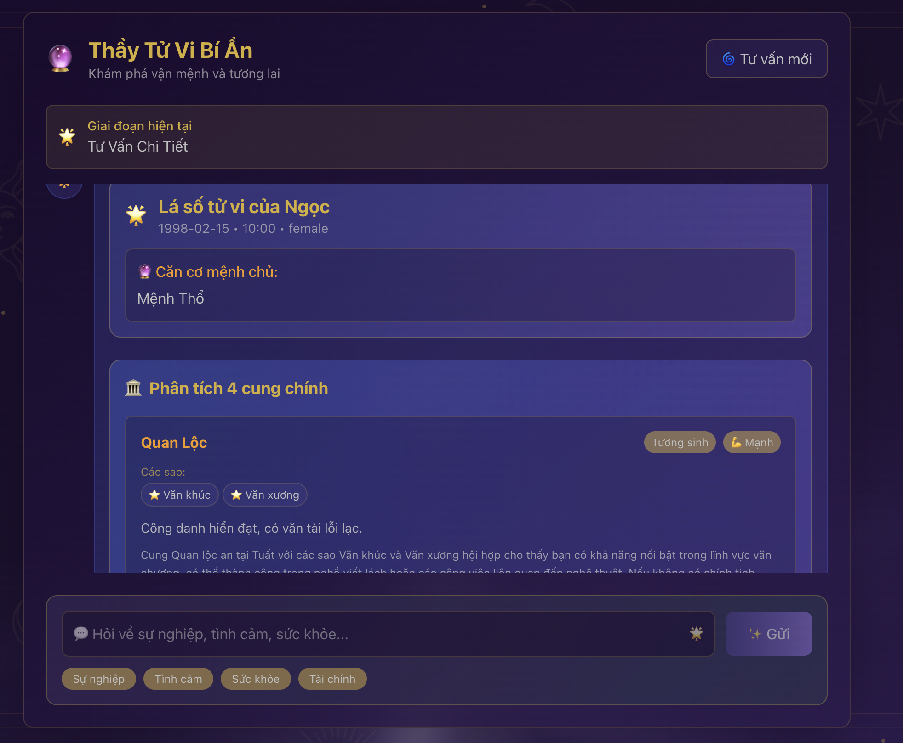

# 🔮 Tử Vi Bot - Intelligent Conversation Flow

Website tư vấn tử vi thông minh sử dụng AI với khả năng conversation tự nhiên và trích xuất thông tin thông minh.



## ✨ Tính năng chính

### 🧠 Intelligent Conversation Flow
- **LLM-based Analysis**: Sử dụng AI để phân tích ý định và context của người dùng
- **Smart Information Extraction**: Tự động trích xuất thông tin từ toàn bộ cuộc hội thoại
- **Dynamic Conversation**: Không còn step-based cứng nhắc, conversation tự nhiên như consultant thật
- **Context Awareness**: Hiểu được ngữ cảnh và nhớ thông tin từ các tin nhắn trước
- **Automatic Analysis Trigger**: Tự động phát hiện khi đủ thông tin và tiến hành phân tích

### 🔄 Flow hoạt động
```
User Message → LLM Analysis → Extract Info → Check Completeness → Generate Response
     │              │              │              │
     ▼              ▼              ▼              ▼
"Xin chào" → conversation_analysis → extract_intelligently → Complete? → Smart Response
```

### 📊 Database & Memory
- **SQLite Database**: Lưu trữ persistent session và chat history
- **ChatSummaryMemoryBuffer**: Tóm tắt context thông minh để tiết kiệm token
- **Session Management**: Quản lý trạng thái conversation thông minh

## 🛠️ Công nghệ sử dụng

### Backend
- **Python 3.8+** với Flask
- **OpenAI GPT-4o-mini** cho LLM analysis
- **LlamaIndex** cho RAG và memory management
- **SQLite** cho database
- **Pydantic** cho data validation
- **LunarCalendar** cho tính toán âm lịch

### Frontend
- **Next.js 14** với TypeScript
- **TailwindCSS** cho styling
- **React Components** cho UI

## 🚀 Setup & Installation

### 1. Clone repository
```bash
git clone <repository-url>
cd tu-vi-bot
```

### 2. Setup Backend

#### Tạo file environment
```bash
# Tạo file .env trong thư mục gốc
touch .env
```

Thêm vào file `.env`:
```env
OPENAI_API_KEY=your_openai_api_key_here
```

#### Cài đặt dependencies
```bash
pip install -r requirements.txt
```

#### Khởi tạo database
```bash
python -c "from models import Base, engine; Base.metadata.create_all(engine); print('Database initialized!')"
```

#### Chạy backend
```bash
python app.py
```

Backend sẽ chạy tại: `http://localhost:5000`

### 3. Setup Frontend

```bash
cd frontend
npm install
npm run dev
```

Frontend sẽ chạy tại: `http://localhost:3000`

## 📁 Cấu trúc dự án

```
tu-vi-bot/
├── 📁 backend/
│   ├── app.py                 # Flask API server
│   ├── chat.py               # Intelligent conversation logic
│   ├── models.py             # Database models
│   ├── requirements.txt      # Python dependencies
│   └── storage/              # Vector store & indexes
├── 📁 frontend/
│   ├── src/
│   │   ├── app/             # Next.js app directory
│   │   ├── components/      # React components
│   │   └── styles/          # CSS styles
│   ├── package.json
│   └── tailwind.config.ts
├── 📁 docs/
│   ├── INTELLIGENT_CONVERSATION_FLOW.md
│   └── FLOW_DIAGRAM.md
└── README.md
```

## 🔧 API Endpoints

### POST `/api/reply`
Gửi tin nhắn và nhận phản hồi từ bot

**Request:**
```json
{
  "message": "phan ngọc, nam, 05/10/1993, giờ sinh: 14:00",
  "uuid": "user_session_id"
}
```

**Response:**
```json
{
  "reply": "🔮 Phân tích tử vi cho phan ngọc...",
  "status": "success"
}
```

## 🧪 Testing

### Test intelligent conversation flow
```bash
python demo_intelligent_flow.py
```

### Test specific scenarios
```bash
python -c "
from chat import prompt_to_predict
result = prompt_to_predict('Phan Nhân, nam, 05/12/1990, giờ sinh: 14:00', 'test_user')
print(result)
"
```

## 📚 Documentation

- [Intelligent Conversation Flow](./docs/INTELLIGENT_CONVERSATION_FLOW.md) - Chi tiết về flow thông minh
- [Flow Diagram](./docs/FLOW_DIAGRAM.md) - Sơ đồ flow và database schema

## 🎯 Tính năng nổi bật

### 1. Smart Information Detection
Bot tự động phát hiện khi đủ thông tin (tên, ngày sinh, giờ sinh, giới tính) và tiến hành phân tích.

### 2. Natural Conversation
Không còn step-based cứng nhắc, bot hoạt động như consultant thật với khả năng:
- Hiểu context và ý định
- Trích xuất thông tin thông minh
- Phản hồi tự nhiên và phù hợp

### 3. Context Awareness
- Nhớ thông tin từ cuộc hội thoại trước
- Sử dụng ChatSummaryMemoryBuffer để tóm tắt context
- Lưu trữ persistent trong SQLite

### 4. Error Handling
- Xử lý lỗi một cách thông minh
- Fallback mechanisms khi LLM fail
- Graceful degradation

## 🔍 Dữ liệu tham khảo

- **Tử vi truyền thống**: Tham khảo từ [tuvi.vn](https://tuvi.vn/)
- **Phương pháp tính toán**: Theo tử vi cổ truyền Việt Nam
- **Các sao chính**: 14 chính tinh, cát tinh, sát tinh, hóa tinh

## 🤝 Contributing

1. Fork repository
2. Tạo feature branch (`git checkout -b feature/AmazingFeature`)
3. Commit changes (`git commit -m 'Add some AmazingFeature'`)
4. Push to branch (`git push origin feature/AmazingFeature`)
5. Tạo Pull Request

## 📄 License

Distributed under the MIT License. See `LICENSE` for more information.
