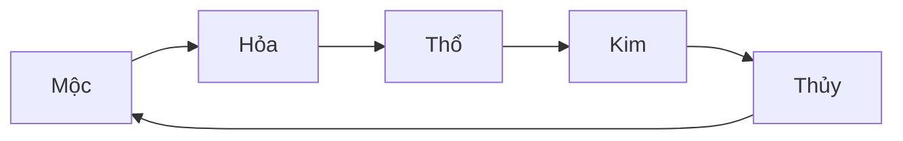
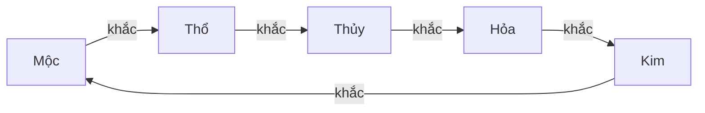
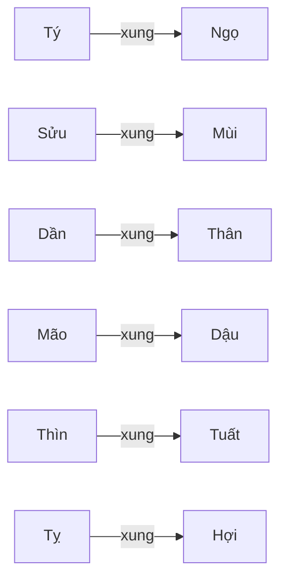

# Dưới đây là các **Mermaid diagrams** để bạn copy-paste dùng ngay, thể hiện **tương sinh – tương khắc (ngũ hành)** và **tam hợp – tứ hành xung (12 địa chi)**.

---

### 1) Ngũ hành – **Tương sinh**



---

### 2) Ngũ hành – **Tương khắc**



---

### 3) **Tam hợp** (4 bộ tam giác)

```mermaid
graph TB
    subgraph Thủy Thân–Tý–Thìn
        T1[Thân] --- T2[Tý]
        T2[Tý]  --- T3[Thìn]
        T3[Thìn] --- T1[Thân]
    end

    subgraph Kim Tỵ–Dậu–Sửu
        K1[Tỵ]  --- K2[Dậu]
        K2[Dậu] --- K3[Sửu]
        K3[Sửu] --- K1[Tỵ]
    end

    subgraph Mộc Hợi–Mão–Mùi
        M1[Hợi] --- M2[Mão]
        M2[Mão] --- M3[Mùi]
        M3[Mùi] --- M1[Hợi]
    end

    subgraph Hỏa Dần–Ngọ–Tuất
        H1[Dần] --- H2[Ngọ]
        H2[Ngọ] --- H3[Tuất]
        H3[Tuất] --- H1[Dần]
    end
```

---

### 4) **Tứ hành xung** (6 cặp xung đối)



> Gợi ý dùng:
>
> * Dùng (1) + (2) để xem **hợp/khắc theo ngũ hành**.
> * Dùng (3) để xem **tam hợp** (hợp mạnh trong hôn nhân/đồng đội).
> * Dùng (4) để xem **tứ hành xung** (dễ mâu thuẫn/xung khắc).
